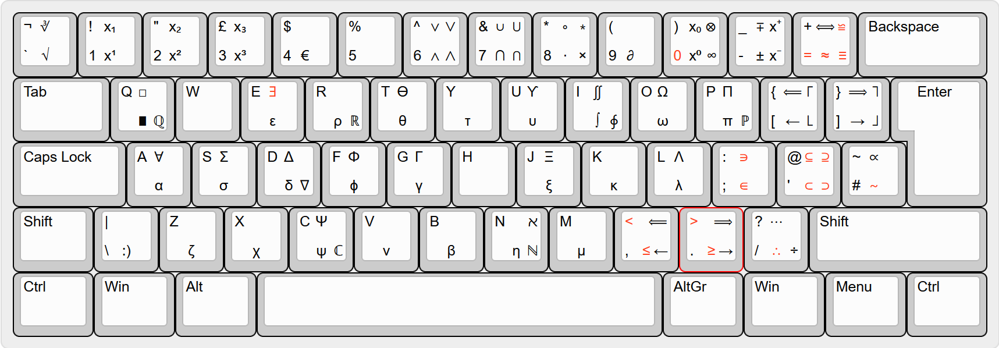

# MathsKB - An ISO layout for anyone without enough pure notation in their life

## What is MathsKB
Ever wanted to type this in pure text without needing LaTeX or copying alt codes?

{(θ, r) | θ ≤ 2π, r∈ℕ}

Probably not, but ever wanted to type the symbol "²" in a whatsapp chat from a PC, without having to google 'squared number symbol'? then this is the keyboard layout for you! 

## General Info

#### Prerequisites
 - Windows only! linux likely coming soon, macOS only if someone makes a fork or something
 - Assumption that you don't use Caps Lock for typing shift, as there are symbol that exist on the Caps Lock layer.
 - This isn't an excuse to skimp on LaTeX terms! just for platforms that don't use it

#### How to use
 - Navigate to Releases section
 - Download `mathskb.zip` and export somewhere
 - run `setup.exe`
 - restart your system (if it doesn't work)
 - Since this just adds on to the normal English(United Kingdom), it can effectively replace your current keyboard layout
 - **Note: keep the installation folder. you will need setup.exe if you want to uninstall later**
 - If you want to uninstall, just run setup.exe again

#### Basics of the layout:
In addition to the regular shift layer, this layout uses the following layers
- AltGr (right alt, or ctrl + alt)
- AltGr + shift (or ctrl + alt + shift)
- Caps Lock
- Caps Lock + Shift
Note that the original EN-GB ISO layout is unaltered, and you can still use it like normal

#### Customising
Use Microsoft Keyboard Layout Creator. [Link to download here](https://www.microsoft.com/en-us/download/details.aspx?id=102134)
- Clone the repository into `"USER"/Documents/MathsKB`. This is because the export location is `Documents/KEYBOARD_NAME`, and you can't change it for some reason (wtf microsoft?)
- File -> Load Source File and choose the `.klc` file. You can troubleshoot existing layouts that don't work using File -> Load Existing Keyboard to load keyboards already installed to your PC if stuff randomly doesn't work
- Project -> Build DLL and Setup Package to create the source binaries. NOTE: you need to uninstall the existing keyboard layout if you have it installed, a new layout can't be created under the same name.
- Restart your PC if you had the file installed before. The new installed layout will just be the previous one until you restart for some reason

## The actual layout

- Upper rows mean shift layer, lower rows mean no shift
- Left Column means normal
- Middle column means AltGr
- Right Column means Caps Lock
e.g. the way you would get "∂" is AltGr + 9, and the way you would get "ℝ" is Caps Lock + r.

#### General layout rules
- Greek letters are on AltGr + alphabet key, and the uppercase version is on AltGr + Shift + key. The arrangement of the key is in accordance to the Greek typing layout, but is mostly the same. For example, α is AltGr + a, σ is AltGr + s, Σ is AltGr + Shift + s.
- MathBB letters are on Caps Lock + alphabet key. The microsoft keyboard layout editor is very crusty and old, so I could only put on characters with up to 4 letters in their unicode code, but is enough to cover the standard sets (ℕ,ℤ,ℝ,ℂ,ℚ)
- Superscript is on AltGr + 0, 1, 2, 3, and subscript is on AltGr + Shift + 0, 1, 2, 3 respectively. Additionally there is superscript ⁺ and ⁻ bound to AltGr + -, and AltGr + Shift + ⁺ respectively. Note that the x in the picture isn't included it's just to see the difference.

#### Dead Key
Any symbol in the picture that is marked in a red font can be used in the "dead key". This is a key that is used in combination with another key to create a modified key. A common example in other languages is using ' in addition with a key to create accents, e.g. ' followed by "a" = "à". 

In this case the dead key usage is for "not" symbols. Dead key is accessed by AltGr + /, and then press a compatible key to create the new symbol. Note, AltGt + / followed by a space will be the listed red key on the picture, i.e. ∴. A list of modified symbols is included below.

| Keymap | Resulting Key |
| ------ | ------------- |
| = | ≠ |
| ≈ | ≉ |
| ≡ | ≢ |
| ≅ | ≇ |
| < | ≮ |
| > | ≯ |
| ≤ | ≰ |
| 0 | ∅ |
| ≥ | ≱ |
| ∃ | ∄ |
| ∈ | ∉ |
| ∋ | ∌ |
| ⊂ | ⊄ |
| ⊆ | ⊈ |
| ⊃ | ⊅ |
| ⊇ | ⊉ |
| ∼ | ≁ |

#### Random keymaps with ways to remember it
- Arrows{←,→} are on Caps Lock + {<,>}, while Implies notation {⟺, ⟹,⟸,} are on Caps Lock + Shift + {<,>,=} cos they look like arrows
- Wedge/∧ is on AltGr + 6 cos it looks like a Carat, with Vee/∨ on AltGr + Shift + 6. Larger versions are on the caps lock layer(⋀,⋁)
- Cap/∩ is on AltGr + 7 cos "∩" and "&" both mean "and", with Cup/∪ on AltGr + Shift + 6. Larger versions are on the caps lock layer(⋂,⋃)
- Less than/≤ and Greater than/≥ are on AltGr + their respective < and > keys
- Primary school ÷ and × are on Caps lock  + "." or "/", as they also can represent multiplication and division respectively
- There is a myriad of "times" symbols on combinations of 8, since * is representative of multiplication. These are {∙, ∗, ∘}. Look at the chart to figure out
- There is also a myriad of "equals" symbols on combinations of =. This includes iff (⟺)
- Partial Derivative sign/ ∂ is on AltGr + 9, cos it looks like an upside down 9
- Infinity is on Caps Lock + 0, cos it's like the opposite of 0 kinda idk, while tensor ⊗ is on Caps Lock + Shift + 0, cos it's kinda circular shape :p
- QED symbols are on AltGr + Q for ∎, and AltGr + Shift + Q for □.
- All and Exists (∀, ∃) are on AltGr + Shift + A and AltGr + Shift + E cos they start with the same letter (kinda)
- Integrals are on I cos they start with the letter I
- ∼ (this is like A ∼ B relation) and proportionality (∝) are bound to the regular ~ key
- √ and ∛ are on the ` key (top left one) just so it's next to all the superscript keys
- Floor and Ceiling, {⌊,⌋,⌈,⌉} are on Caps + [] for floor, and Caps + Shift + [] for ceiling, since they kinda look like part of a []
- AltGr + Shift + Spacebar produces a zero-width space, perfect for increasing the character counts in essays! (joke do not do this)
- AltGr + \ creates a smiley face :) This can boost your mental state while studying at the library at 3am